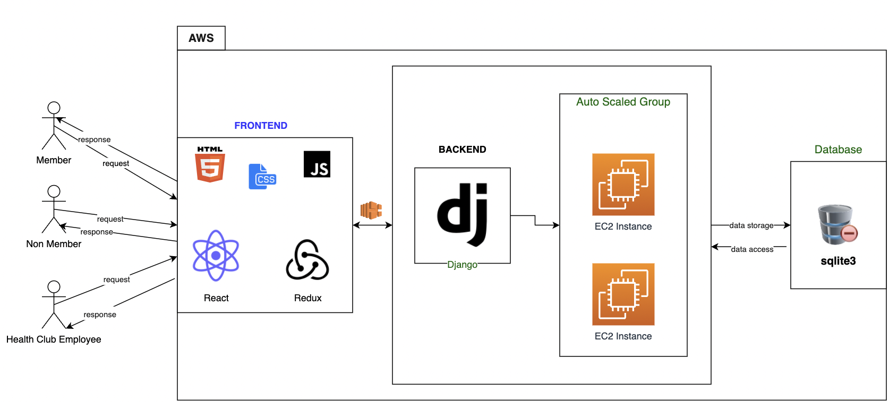
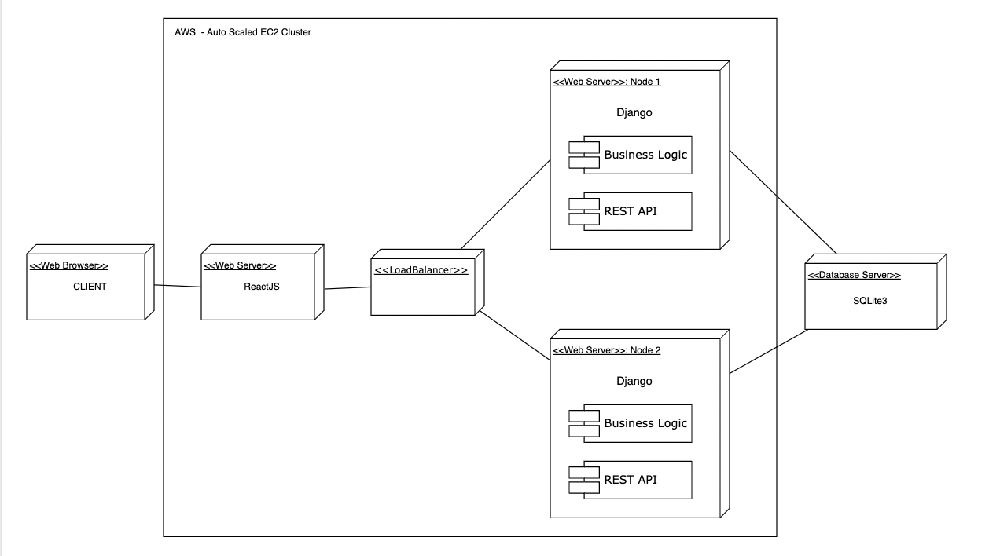
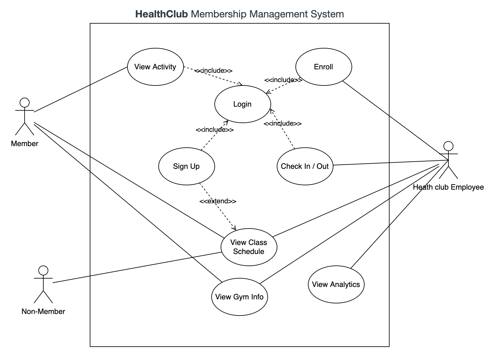

# team-project-skvh
team-project-skvh created by GitHub Classroom

# TEAM-Project SKVH

## 
**HealthClub Membership Management System**

This system is designed to help manage memberships and class schedules at a health club. It includes APIs for accessing information and functionality, as well as a web/mobile UI for members, non-members, and health club employees.

## 
**Team Members**

	

* Shail Patel
* Vandana Patel
* Kunjal Shah
* Hardik Ghori

## Responsibilities:

**1. Shail:**

* Responsible for planning and documenting the project requirements.
* Implemented user models and the authentication system.
* Designed the necessary APIs for the homepage functionality.
* Shail collaborated with Kunjal to develop the API for logging instruments used by checked-in users.
* Shail worked with Hardik to design and integrate the feature for logging instruments.

**2. Kunjal:**

* Researched and decided on the appropriate technology stack to be used in the project.
* Kunjal collaborated with Hardik to set up the initial structure and foundation of the backend code.
* Developed the admin panel functionality to enable adding new instruments and assigning resources to gym locations.
* Implemented the API that handled free trial requests.
* Kunjal worked with Vandana to design and implement the analytics API for tracking the number of visitors to the gym.

**3. Hardik:**

* Created the architectural diagram for the project, illustrating the system's structure and components.
* Hardik collaborated with Kunjal to set up the initial structure and foundation of the backend code.
* Hardik worked with Shail to deploy and migrate the data models to a locally managed MySQL database.
* Developed the admin panel functionality for adding new classes and managing their schedules.
* Implemented the check-in and check-out procedure for gym members.
* Designed and implemented the analytics API for tracking the hours spent in the gym.

**4. Vandana:**

* Created all the discussed data models for the gym, equipment, schedules, and classes.
* Vandana collaborated with Shail to design the necessary APIs for the homepage.
* Created the wireframes for the user interface, outlining the visual layout and design.
* Integrated the schedule calendar with the API, ensuring it aligned with different gym locations.
* Designed and implemented the analytics API for tracking class enrollment over specific time periods.
* Vandana collaborated with Kunjal to design the analytics page that displayed the number of visitors to the gym during different hours and days of the week.

# Tools and Languages:

    Frontend - React

    Backend - Python Django

    Database - SQLite3

    Deployment - AWS EC2 Autoscaled group

## XP Core Values Implemented

1. **Simplicity**
    * As a team, we assessed each feature required for the program and opted for the most effective yet simple tools and technologies.
    * By carefully evaluating each feature and selecting straightforward yet effective tools and technologies, we ensured that our program was not only easy to use but also efficient in delivering its intended functions.
1. **Respect**
    * Every week, our team focused on the XP Core Value of Respect. We discussed the importance of treating each other with respect, being mindful of our communication, and respecting everyone's role.
    * We agreed to practice active listening and ensure everyone feels heard and respected in meetings.

## **Features by Role**

### Members

* View the home page with information about the gym and available memberships and class schedules
* View their individual class schedule
* View activities from the past week, month, or last 90 days
* Signup for classes in advance
* Log hours on treadmill, cycling, stair machines, or weight training

### Non-Members

* View the home page with information about the gym and available memberships and class schedules
* Sign up for a free trial membership

### Health Club Employees (Admins)

* View the home page with information about the gym and available memberships and class schedules
* Enroll new members
* Check in members as they arrive each day
* Checkout members as they exit each day
* Signup non-members for free trials
* View an analytics dashboard showing user activity summarized by location, including classes and enrollment by day/week, hours spent in the gym by day/week/month, and number of visitors by the hour each day, weekday, and weekend
* Access any other useful dashboard that helps plan gym hours, schedules, and equipment inventory

#### Note: All roles have access to the home page, which provides basic information about the gym and available memberships and class schedules. The home page also allows users to select a location to view corresponding schedules.

## GITHUB REPO LINK

**_TODO_**

### Weekly Scrum Board

[https://docs.google.com/document/d/1czA4NrqPjk_5Ac9Ci2JjRZKj_aMWVBgfvLu5hFUHJEc/edit#heading=h.trc4oyiwskjc](https://docs.google.com/document/d/1czA4NrqPjk_5Ac9Ci2JjRZKj_aMWVBgfvLu5hFUHJEc/edit#heading=h.trc4oyiwskjc) 

## TaskSheet & Burndown Charts

[https://docs.google.com/spreadsheets/d/1zeU2K-W-42jAwyu8K5sS-E_FTBThfeprQRj7bWP147U/edit#gid=0](https://docs.google.com/spreadsheets/d/1zeU2K-W-42jAwyu8K5sS-E_FTBThfeprQRj7bWP147U/edit#gid=0) 

# Project Diagrams:

## UI wireframes

&lt;link to add TODO>

## Architecture Diagram:

# 

>>>>>  gd2md-html alert: inline image link here (to images/image1.png). Store image on your image server and adjust path/filename/extension if necessary.  (<a href="#">Back to top</a>)(<a href="images/image1.png">Next alert</a>) >>>>> 

## Deployment Diagram

>>>>>  gd2md-html alert: inline image link here (to images/image2.png). Store image on your image server and adjust path/filename/extension if necessary.  (<a href="#">Back to top</a>)(<a href="images/image2.png">Next alert</a>) >>>>> 

## Use Case Diagram

>>>>>  gd2md-html alert: inline image link here (to images/image3.png). Store image on your image server and adjust path/filename/extension if necessary.  (<a href="#">Back to top</a>)(<a href="images/image3.png">Next alert</a>) >>>>> 

## **Design Decisions**

**Frontend:** We have decided to use React as our frontend framework because of its ability to create reusable UI components, manage application state effectively, and its popularity among developers. React allows us to build a responsive and interactive UI that can be easily updated without reloading the page, providing a seamless user experience for our Health Club members, non-members, and employees.

**Backend: **We have chosen Python Django as our backend framework because of its robustness, scalability, and ease of use. Django comes with many built-in features such as ORM, URL routing, and templating that make it easy to develop complex web applications. Additionally, Django provides strong security measures out of the box, which is critical for our Health Club membership management system.

**Database:** We have selected SQLite as our database management system because of its simplicity, efficiency, and ease of use. SQLite is a lightweight and self-contained database engine that can be easily integrated with Django. As our Health Club membership management system is not expected to have a high volume of transactions, SQLite is a suitable choice for our application.

